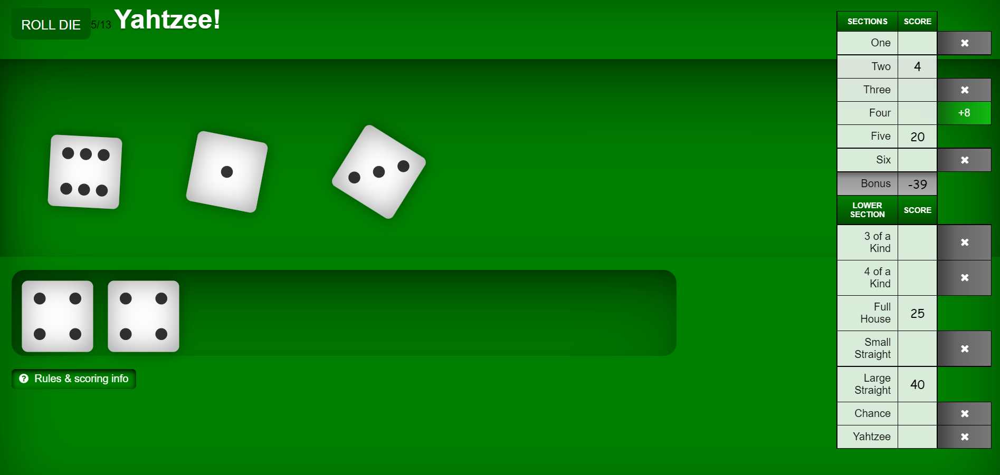

# Yahtzee-JS
The popular game Yahtzee

The goal of Yahtzee is to try and get different dice combos using five dice.

This was my first real web project. It taught me alot about how to use Javascript to edit and manipulate html elements and more CSS tricks like making linear colors.

## Rules

The objective of the game is to score points by rolling five dice to make certain combinations. The dice can be rolled up to three times in a turn to try to make various scoring combinations and dice must remain in the box. A game consists of thirteen rounds. After each round, the player chooses which scoring category is to be used for that round. Once a category has been used in the game, it cannot be used again. The scoring categories have varying point values, some of which are fixed values and others for which the score depends on the value of the dice. A Yahtzee is five-of-a-kind and scores 50 points, the highest of any category. The winner is the player who scores the most points.

[Play It Here](https://casterradev.github.io/Yahtzee/)
